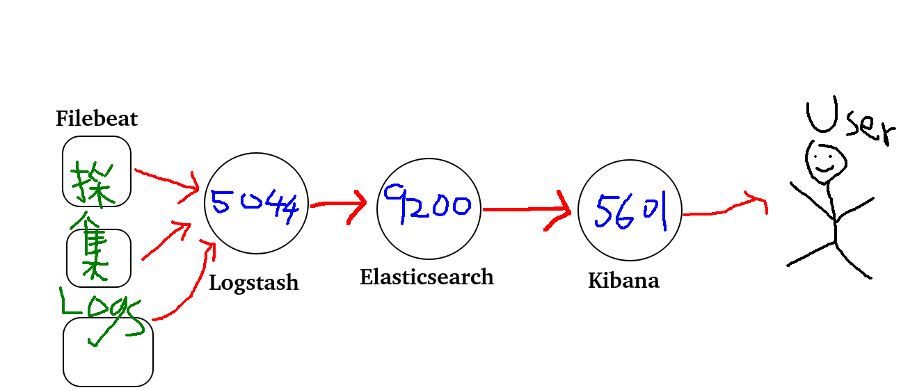

# Elastic簡介

### Elastic特點

一個分散式搜尋分析系統, 除了資料庫功能外, 還有base on Apache Lucene為基礎建置的<font color="#dd0000">開放原始碼, 分散式, RESTful</font>的檢索架構, 還具有高度的<font color="#dd0000">可擴充性(scalability)與可用性(availability)</font>


### ELK?

ELK Stack 是指 Elasticsearch, Logstash和Kibana 這三個Open Source軟體的集合套件

- Elasticsearch：核心資料庫是NOSQL的一種, 但跟一般NOSQL的資料庫比較不一樣的地方, Elasticsearch是透過JSON的方式來進行所有的CRUD(select, insert, update, delete)操作與設定
- Logstash：收集各式各樣的Log或是資訊, 並且根據你的Log來Parser成你要的資料欄位 
- Kibana：視覺化與圖形化的方式來顯示各種Log, 可以透過Elasticsearch資料庫來建立
- Beats：針對特定要收集的Log, 官方量身定做的輕量級日誌收集與轉送套件, 目前的Beats有Filebeat, Packetbeat, Winlogbeat, Metricbeat, Heartbeat, Auditbeat等, 跟Logstash 功能差不多, 但只能單純的轉送Log無法像Logstash一樣自訂Parser

### 名詞

```
----------------------------
RDBMS        | ElasticSearch
Server       | Node
DB           | Index
Table        | Type
Primary key  | Id
Row          | Document
Column       | Field
Schema       | Mapping
----------------------------
```

### 參考

- https://its-security.blogspot.com/2018/02/introduction-elasticsearch.html

- https://godleon.github.io/blog/Elasticsearch/Elasticsearch-getting-started/

- https://godleon.github.io/blog/


# ELK Install On Rocky Linux

安裝順序: Elasticsearch > Kibana > Logstash > Beats

Elasticsearch是非關聯式資料庫以JSON格式儲存資料 擁有一個非常厲害的索引功能 默認為9200port

Logstash是一個過濾器 會把所有採集到的Log傳到logstash中 logstash可以依照規則將Log分割並傳遞到ElasticSearch 默認是5044port

Kibana 是圖形化展示工具 將儲存在Elasticsearch內的資料用各式各樣圖表呈現出來 默認是5601port

Beats 是Log採集工具 負責將本台電腦的Log檔取出傳遞到logstash做過濾



## Install OpenJDK

```bash
sudo dnf install java-1.8.0-openjdk.x86_64 java-1.8.0-openjdk-devel.x86_64
```

## Step-1: Install Elasticsearch 7.x

```bash
sudo vi /etc/yum.repos.d/elasticsearch.repo
```

內容:

```txt
[elasticsearch-7.x]
name=Elasticsearch repository for 7.x packages
baseurl=https://artifacts.elastic.co/packages/7.x/yum
gpgcheck=1
gpgkey=https://artifacts.elastic.co/GPG-KEY-elasticsearch
enabled=1
autorefresh=1
type=rpm-md

```

```bash
sudo rpm --import https://artifacts.elastic.co/GPG-KEY-elasticsearch
sudo dnf clean all
sudo dnf makecache
sudo dnf install elasticsearch
```

### Configure Elasticsearch

修改 Elasticsearch 的集群名稱。還要確保取消註釋 network.host 選項並僅在設置多節點集群時添加 Elasticsearch 主機的 IP 以進行端口綁定

```bash
sudo vim /etc/elasticsearch/elasticsearch.yml

啟動
sudo systemctl enable --now elasticsearch.service

檢查
systemctl status elasticsearch
```

## Step-2: Install and Configure Logstash

```bash
sudo dnf install logstash -y

安裝成功後，我們需要編輯 Logstash 的配置文件來添加 Input 和 output 變量，如下所示
我們還需要將 Logstash 應用程序指向在端口 9200 上運行在同一主機上的 Elasticsearch 應用程序
請注意，您也可以在與 Elasticsearch 不同的服務器上運行 Logstash

sudo vi /etc/logstash/conf.d/logstash.conf
```

```txt
input {
  beats {
    port => 5044
  }
}
output {
  elasticsearch {
    hosts => ["localhost:9200"]
    manage_template => false
    index => "%{[@metadata][beat]}-%{[@metadata][version]}-%{+YYYY.MM.dd}"
  }
}
```

```bash
啟動
sudo systemctl enable --now logstash

檢查
sudo systemctl status  logstash
```

## Step-3: Install and Configure Kibana

```bash
sudo dnf -y install kibana
sudo vim /etc/kibana/kibana.yml
```

```txt
將 Kibana 的端口綁定配置為使用任何 IP 或特定 IP (配置 Kibana 以監聽任何 IP)
server.host: "0.0.0.0"
elasticsearch.url: "http://localhost:9200"
```

```bash
啟動
sudo systemctl enable --now kibana

檢查
systemctl status kibana

開啟防火牆, 讓User可以連, 才能用網頁
sudo firewall-cmd --permanent --add-port=5601/tcp
sudo firewall-cmd --reload
```

## Step-4: Shipping Logs to ELK stack using Filebeat

```bash
sudo dnf install filebeat

列出可以分析的log模組
sudo filebeat modules list

啟用模組
sudo filebeat modules enable <module>

初始化filebeat
sudo filebeat modules enable system
sudo filebeat setup

執行以下命令加載 filebeat 模塊並連接到 ELK 實例：
filebeat -e

啟動服務
sudo systemctl start filebeat
```

Access the ELK dashboard on your web browser at http://server-IP:5601

## 參考

- [參考](https://www.golinuxcloud.com/install-elk-stack-on-rocky-linux-8/)

### Filebeat 設定

- sudo vim /etc/filebeat/filebeat.yml

- Filebeat inputs 加入log路徑, 用 Logstash Output 當輸出
