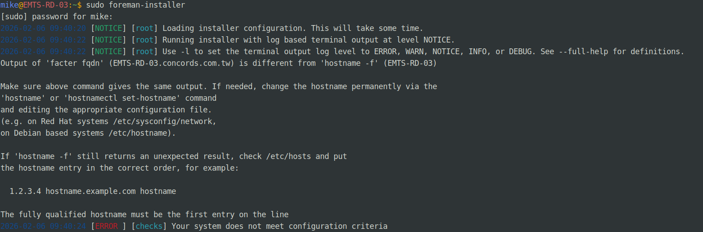
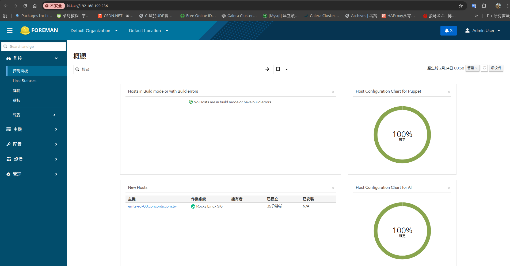
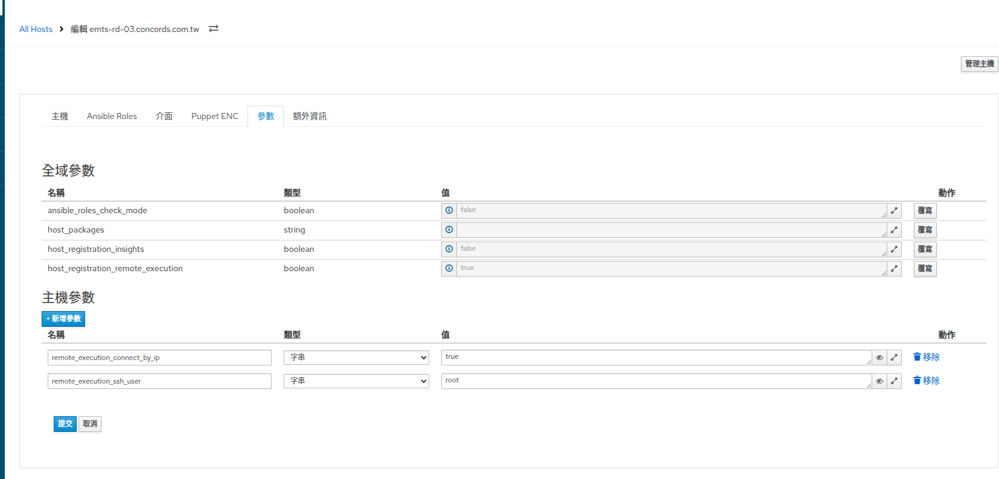

# 規劃 Foreman 架構

```bash
[ Foreman Server ]
  ├─ Web UI (20443)
  ├─ PostgreSQL
  ├─ TFTP (PXE)
  ├─ DHCP (可外掛)
  ├─ DNS  (可外掛)
  └─ Ansible (Remote Execution)
```

**硬體建議**

| 項目  | 建議                        |
| ---- | -------------------------  |
| OS   | Rocky Linux 10 / Alma 10   |
| CPU  | 4 core（建議 8）            |
| RAM  | **8G 起跳（16G 舒服）**      |
| Disk | 100G+ |


# 開始安裝步驟

[Enterprise Linux 9 為例]((https://docs.pingcap.com/zh/tidb/dev/tiup-cluster-topology-reference))

Enable Puppet's 8.x repository:

```bash
sudo dnf -y install https://yum.puppet.com/puppet8-release-el-9.noarch.rpm
```

Enable the Foreman repositories:

```bash
sudo dnf -y install https://yum.theforeman.org/releases/3.17/el9/x86_64/foreman-release.rpm
```

Downloading the installer

```bash
sudo dnf -y install foreman-installer
```

Running the installer

```bash
sudo foreman-installer
```



問題1:需要設定host

```bash
sudo hostnamectl set-hostname emts-rd-03.concords.com.tw
```

```bash
sudo vi /etc/hosts

192.168.x.x emts-rd-03.concords.com.tw EMRS-RD-03
```


先把 PostgreSQL server 裝起來，補上 initdb（就算 installer 後續會裝，你先補齊，避免它一直卡）

```bash
sudo dnf -y install postgresql postgresql-server
command -v initdb
ls -l /usr/bin/initdb
```

command -v initdb 必須要回 /usr/bin/initdb 才算過關。

記得開443的防火牆然後直接在瀏覽器上https://192.168.199.236

就可以進到登入畫面了

Initial credentials are admin / LbdjQn8dJbXz8CqA

登入後長這樣



# Foreman → Ansible 控制台

Step 1 — 確認 Ansible Plugin 有裝

```bash
rpm -qa | grep foreman-plugin-ansible

沒有輸出東西的話就安裝

sudo dnf install -y foreman-plugin-ansible

啟用ansible

sudo foreman-installer --enable-foreman-plugin-ansible
```

Step 2 — 啟用 Remote Execution

```bash
sudo foreman-installer \
  --enable-foreman-plugin-remote-execution \
  --enable-foreman-proxy-plugin-remote-execution-script
```

Step 3 — 建立 foreman-proxy 的 SSH 金鑰

在 Foreman 主機上執行：

```bash
sudo -u foreman-proxy mkdir -p ~foreman-proxy/.ssh
sudo -u foreman-proxy ssh-keygen -t ed25519 -N "" -f ~foreman-proxy/.ssh/id_ed25519
```

然後：

```bash
sudo -u foreman-proxy cat ~foreman-proxy/.ssh/id_ed25519.pub
```

把那一整行複製起來。

🧱 Step 4 — 把金鑰加到被控主機

因為你現在是「自己控自己」測試：

```bash
sudo mkdir -p /root/.ssh
sudo vi /root/.ssh/authorized_keys
```

把剛剛那行貼進去。

然後：

```bash
sudo chmod 700 /root/.ssh
sudo chmod 600 /root/.ssh/authorized_keys
```

🧪 Step 5 — 測試 SSH 是否成功

這一步一定要過：

```bash
sudo -u foreman-proxy ssh -o StrictHostKeyChecking=accept-new root@192.168.199.236 "whoami"
```

如果成功會輸出：
root

設定檔要更新

sudo vi /etc/foreman-proxy/settings.d/remote_execution_ssh.yml


這個要換成 ~foreman-proxy/.ssh/id_ed25519

然後重新啟動服務

```bash
sudo systemctl restart foreman-proxy
```

🧠 Step 6 — UI 設定 Host

UI：
  1. Hosts → All Hosts
  2. 點 emts-rd-03…
  3. Edit
  4. 找 Parameters
新增：

```bash
remote_execution_connect_by_ip = true
remote_execution_ssh_user = root
```



