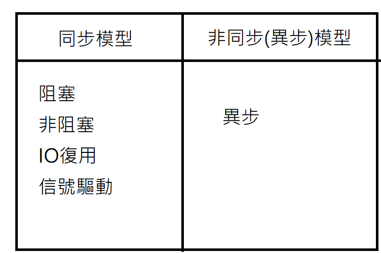
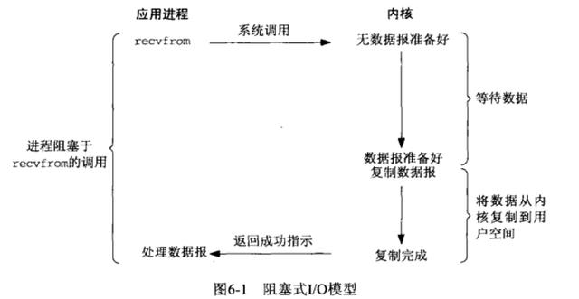
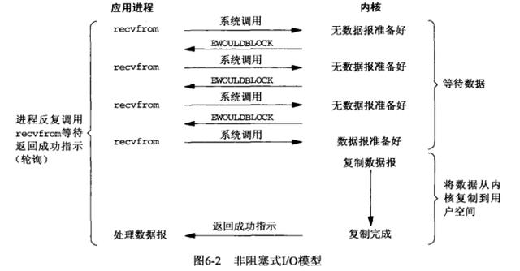
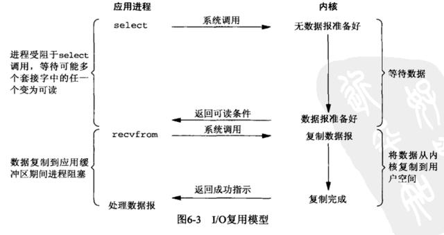
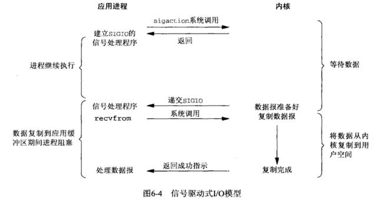
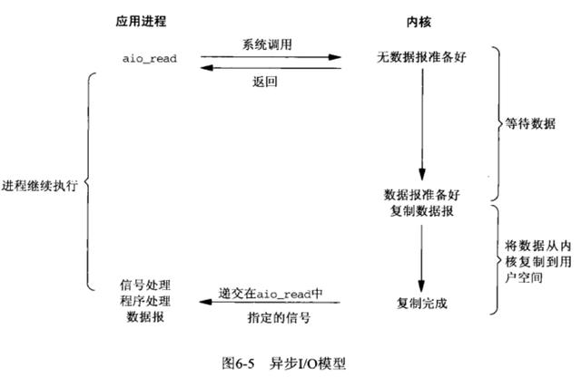

# Linux 網路I/O模型說明

```txt
IO模型描述的是出現I/O等待時進程的狀態以及處理數據的方式
圍繞著進程的狀態, 數據準備到kernel buffer再到app buffer的兩個階段展開
其中數據複製到kernel buffer的過程稱為數據準備階段, 數據從kernel buffer複製到user buffer的過程稱為數據複製階段
對於一個network IO (這裡我們以read舉例), 它會涉及到兩個系統對象,一個是調用這個IO的process (or thread), 另一個就是系統內核(kernel)
當一個read操作發生時, 它會經歷兩個階段：
```

- 等待數據準備 (Waiting for the data to be ready)
- 將數據從內核拷貝到進程中 (Copying the data from the kernel to the process)

這兩點很重要, 因為這些IO Model的區別就是在兩個階段上各有不同的情況

## 5種網路IO模型



```txt
5種IO模型分別是
-阻塞式IO(Blocking IO)
-非阻塞式IO(NonBlocking IO)
-IO復用(select和poll和epoll)
-信號驅動IO(SIGIO)
-異步IO(POSIX的aio_系列函數)
前4種為同步IO操作 只有異步IO模型是異步(非同步)IO操作
```



```txt
我 派克雞排 水煎包 藍家刈包 飲料
舉例: 我想吃這些食物, 我只能一家一家買 我要等G排炸好, 才能去買水煎包, 水煎包OK, 才能去買藍家刈包
```



```txt
我 UberEat外送 派克雞排 水煎包 藍家刈包 飲料
舉例: 我先去派克點餐, 再去其他店點餐, 然後不停的去這些店問說 我的餐點好了嗎?
```



```txt
我 UberEat外送 派克雞排 水煎包 藍家刈包 飲料
舉例: 我請UberEat買這些食物, 讓外送員去做詢問的事情, 餐點好了, UberEat自然會給我 
```



```txt
我想不到...
```



```txt
我 店家
舉例: 我打電話給店家, 店家餐點好了會主動送給我
```

### 參考

- <https://wiyi.org/linux-io-model.html>
- <https://www.huaweicloud.com/articles/26b1b9fda29be3fb03a51370d373ff49.html>
- <https://kknews.cc/zh-tw/code/gm9qx38.html>
- <https://kknews.cc/zh-tw/code/lqkvmg9.html>
- <https://www.itread01.com/content/1610957291.html>
