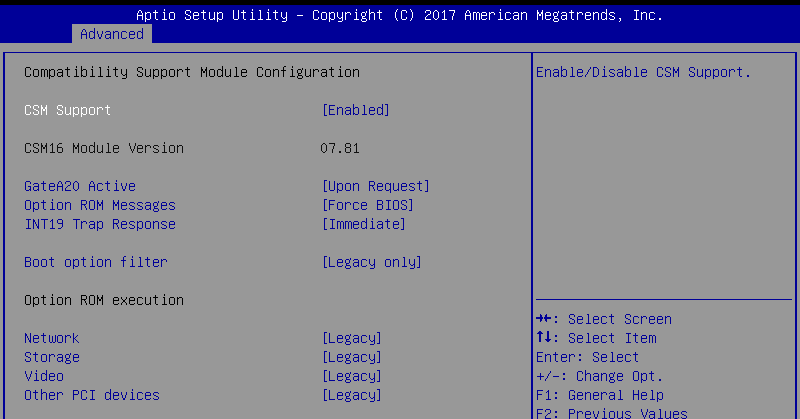
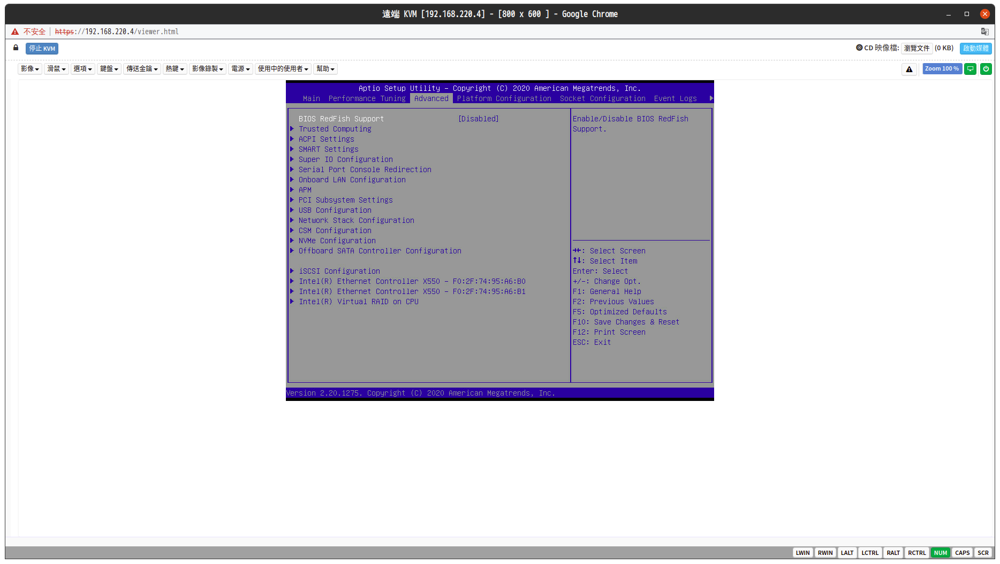
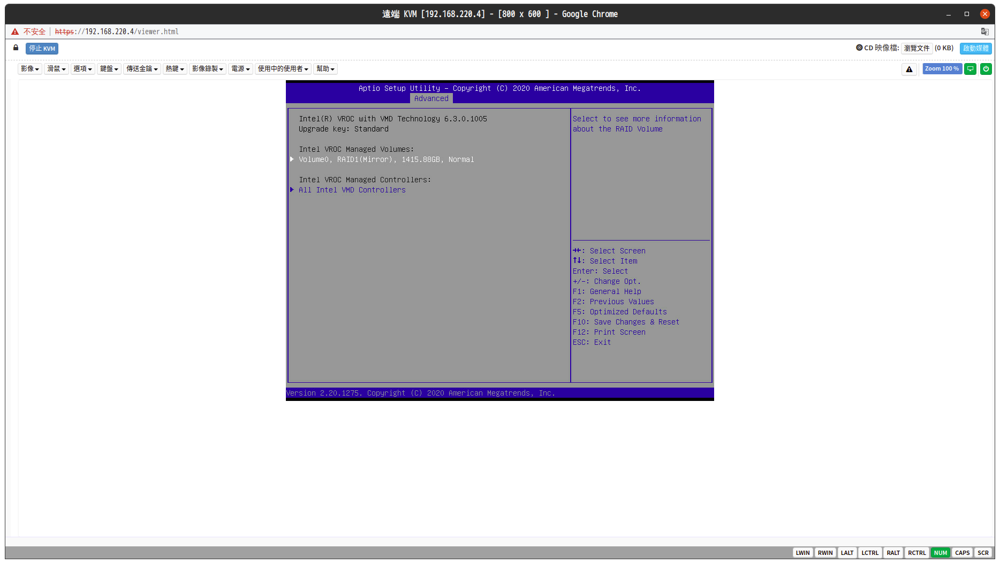

# Intel Virtual RAID on CUP

## 開啟該功能

- 首先要進去BIOS的畫面 (常用的按鍵： Esc、Delete、F1、F2、F8、F10、F11 或 F12)

- 進去Advanced 把 CSM Support 關閉 (Disabled)



- 把設定存下來重啟(F10) 再次進入BIOS 就會看到Intel RAID選項



- 接著就可以進去新增設定



## 設定完後的維護

維護指令 Intel文件第6章

```bash
sudo mdadm -D /dev/md/Volume0

crcft @ ~ on ⎇   $ sudo mdadm -D /dev/md/Volume0
/dev/md/Volume0:
         Container : /dev/md/imsm, member 0
        Raid Level : raid1
        Array Size : 927916032 (884.93 GiB 950.19 GB)
     Used Dev Size : 927916032 (884.93 GiB 950.19 GB)
      Raid Devices : 2
     Total Devices : 2

             State : active 
    Active Devices : 2
   Working Devices : 2
    Failed Devices : 0

Consistency Policy : resync


              UUID : 229b3198:e71c7151:5c715b11:30e94bb2
    Number   Major   Minor   RaidDevice State
       1     259        1        0      active sync   /dev/nvme0n1
       0     259        0        1      active sync   /dev/nvme1n1
```


### 參考文件

Intel 官方文件(Intel/Linux_VROC_6-0_User_Guide.pdf)
Asus 官方文件(Intel/T12488_RS700-E9-RS4_RS12_WEB_10_GA_request_.pdf)