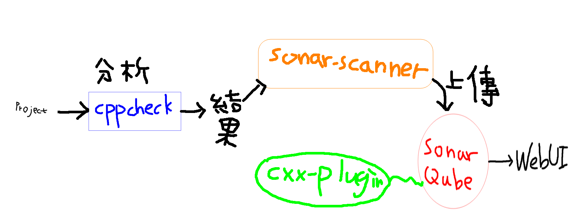

# SonarQube啟動

## 記得在本地生資料夾

```txt
docker pull sonarqube
sudo docker run --name sonarqube --privileged=true \
-v /opt/sonarqube/logs:/opt/sonarqube/logs \
-v /opt/sonarqube/conf:/opt/sonarqube/conf \
-v /opt/sonarqube/data:/opt/sonarqube/data \
-v /opt/sonarqube/extensions:/opt/sonarqube/extensions \
-p 192.168.199.235:9000:9000 -d sonarqube:8.9-community
```

## C/C++的檢測



```txt

需要3種東西

1. cppcheck - sudo dnf --enablerepo=powertools install cppcheck

2. sonar-scanner 的安裝在下面

去 https://docs.sonarqube.org/latest/analysis/scan/sonarscanner/ 下載

# 解壓縮
unzip sonar-scanner-cli-????.zip

# 放置於適當位置
sudo mv sonar-scanner-???? /opt/

# 在 ~/.bashrc 中加入 $PATH 設定
export PATH=$PATH:/opt/sonar-scanner-????-linux/bin

# 重新載入 ~/.bashrc 設定
source ~/.bashrc

3. sonar-cxx-plugin 的安裝在下面

# 先去下載套件 https://github.com/SonarOpenCommunity/sonar-cxx

# 丟到容器裡面 sudo docker cp sonar-cxx-plugin-2.0.7.3119.jar sonarqube:/opt/sonarqube/extensions/plugins/

# 重新啟動 sudo docker restart sonarqube

# 進網頁設定

https://blog.csdn.net/qq_15559817/article/details/100736498
```

## 原始碼覆蓋率 gcovr

```txt
# 先安裝 sudo apt-get install -y gcovr

# 編譯選項要加入 --coverage

# 執行單元測試程式

# 生成報告 gcovr -r . --html --html-details -o coverage/index.html

http://blog.fpliu.com/it/software/gcovr
```

### 範例使用

```txt

先去專案目錄裡 用cppchecke產生報表
cppcheck --xml --xml-version=2 --enable=all . 2> cppcheck-report.xml

然後設定sonar-project.properties
sonar.projectKey=tradingsystem
sonar.qualitygate.wait=true
sonar.source=./
sonar.language=c++
sonar.host.url=192.168.199.235:9000
sonar.sourceEncoding=UTF-8
sonar.cxx.cppcheck.reportPaths=cppcheck-report.xml
sonar.cxx.file.suffixes=.h,.cpp
sonar.scm.disabled=true

上傳回報
-Dsonar.login=後面加該專案的Token
sudo sonar-scanner -Dsonar.login=sqp_519ee049214c43848b05d45d9d4285d6acd6b3fa
```

```SonarQube.yml
version: "3"

services:
  sonarqube:
    image: sonarqube:community
    depends_on:
      - db
    environment:
      SONAR_JDBC_URL: jdbc:postgresql://db:5432/sonar
      SONAR_JDBC_USERNAME: sonar
      SONAR_JDBC_PASSWORD: sonar
    volumes:
      - /opt/sonarqube/data:/opt/sonarqube/data
      - /opt/sonarqube/extensions:/opt/sonarqube/extensions
      - /opt/sonarqube/logs:/opt/sonarqube/logs
      - /opt/sonarqube/conf:/opt/sonarqube/conf
    ports:
      - "9000:9000"
  db:
    image: postgres:12
    environment:
      POSTGRES_USER: sonar
      POSTGRES_PASSWORD: sonar
    volumes:
      - postgresql:/var/lib/postgresql
      - postgresql_data:/var/lib/postgresql/data

volumes:
  sonarqube_data:
  sonarqube_extensions:
  sonarqube_logs:
  postgresql:
  postgresql_data:
```
