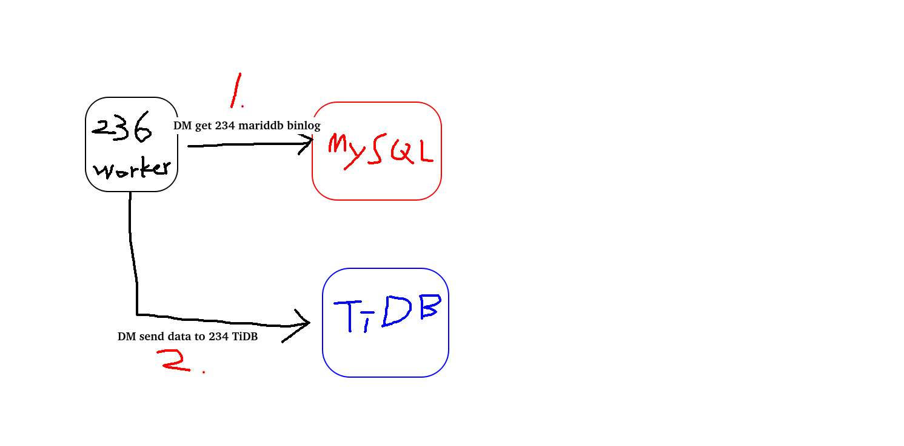

# 佈署TiDB單機模擬集群的樣子

1. 先安裝TiUP, TiUP是TiDB 4.0 版本引入的集群維運工具

```bash
curl --proto '=https' --tlsv1.2 -sSf https://tiup-mirrors.pingcap.com/install.sh | sh
```

設置環境變數

```bash
source .bash_profile
```

確認指令

```bash
which tiup
```

安裝 TiUP 叢集套件

```bash
tiup cluster
```

更新 TiUP 套件至最新版本

```bash
tiup update --self && tiup update cluster
```

查看 TiUP 版本資訊

```bash
tiup --binary cluster
```

2. 設定MaxSessions, 改完要重新啟動service sshd restart, 改這個是為了防止多個程式scp文件時ssh登錄超過數量限制

```bash
vi  /etc/ssh/sshd_confi
----------------------
MaxSessions=20
```

3. 產生佈署文件

[YAML文檔詳細解說](https://docs.pingcap.com/zh/tidb/dev/tiup-cluster-topology-reference)

tuip cluster template > topo.yaml

```yaml
# # Global variables are applied to all deployments and used as the default value of
# # the deployments if a specific deployment value is missing.
global:
 user: "tidb" #會自動產生不用管
 ssh_port: 22
 deploy_dir: "/tidb-deploy" #放執行檔(PD, TiKV, TiDB...)的地方
 data_dir: "/tidb-data" #放資料的地方

# # Monitored variables are applied to all the machines.
monitored:
 node_exporter_port: 9100
 blackbox_exporter_port: 9115

server_configs:
 tidb:
   log.slow-threshold: 300
 tikv:
   readpool.storage.use-unified-pool: false
   readpool.coprocessor.use-unified-pool: true
 pd:
   replication.enable-placement-rules: true
   replication.location-labels: ["host"]
 tiflash:
   logger.level: "info"

pd_servers:
 - host: 192.168.xxx.xxx

tidb_servers:
 - host: 192.168.xxx.xxx

tikv_servers:
 - host: 192.168.xxx.xxx
   port: 20160
   status_port: 20180
   config:
     server.labels: { host: "test-kv-1" }

 - host: 192.168.xxx.xxx
   port: 20161
   status_port: 20181
   config:
     server.labels: { host: "test-kv-2" }

 - host: 192.168.xxx.xxx
   port: 20162
   status_port: 20182
   config:
     server.labels: { host: "test-kv-3" }

tiflash_servers:
 - host: 192.168.xxx.xxx
   tcp_port: 9001

monitoring_servers:
 - host: 192.168.xxx.xxx

grafana_servers:
 - host: 192.168.xxx.xxx
```

TiFlash 部署 (適合 Real-Time HTAP 業務)

```yaml
# # Global variables are applied to all deployments and used as the default value of
# # the deployments if a specific deployment value is missing.
global:
  user: "tidb"
  ssh_port: 22
  deploy_dir: "/tidb-deploy"
  data_dir: "/tidb-data"

# # Monitored variables are applied to all the machines.
monitored:
  node_exporter_port: 9100
  blackbox_exporter_port: 9115
  # deploy_dir: "/tidb-deploy/monitored-9100"
  # data_dir: "/tidb-data/monitored-9100"
  # log_dir: "/tidb-deploy/monitored-9100/log"

# # Server configs are used to specify the runtime configuration of TiDB components.
# # All configuration items can be found in TiDB docs:
# # - TiDB: https://docs.pingcap.com/zh/tidb/stable/tidb-configuration-file
# # - TiKV: https://docs.pingcap.com/zh/tidb/stable/tikv-configuration-file
# # - PD: https://docs.pingcap.com/zh/tidb/stable/pd-configuration-file
# # All configuration items use points to represent the hierarchy, e.g:
# #   readpool.storage.use-unified-pool
# #
# # You can overwrite this configuration via the instance-level `config` field.

server_configs:
  tidb:
    log.slow-threshold: 300
  tikv:
    # server.grpc-concurrency: 4
    # raftstore.apply-pool-size: 2
    # raftstore.store-pool-size: 2
    # rocksdb.max-sub-compactions: 1
    # storage.block-cache.capacity: "16GB"
    # readpool.unified.max-thread-count: 12
    readpool.storage.use-unified-pool: false
    readpool.coprocessor.use-unified-pool: true
  pd:
    schedule.leader-schedule-limit: 4
    schedule.region-schedule-limit: 2048
    schedule.replica-schedule-limit: 64
    replication.enable-placement-rules: true
  tiflash:
    # Maximum memory usage for processing a single query. Zero means unlimited.
    profiles.default.max_memory_usage: 0
    # Maximum memory usage for processing all concurrently running queries on the server. Zero means unlimited.
    profiles.default.max_memory_usage_for_all_queries: 0
  tiflash-learner:
    # The allowable number of threads in the pool that flushes Raft data to storage.
    raftstore.apply-pool-size: 4
    # The allowable number of threads that process Raft, which is the size of the Raftstore thread pool.
    raftstore.store-pool-size: 4
pd_servers:
  - host: 192.168.199.250
    # ssh_port: 22
    # name: "pd-1"
    # client_port: 2379
    # peer_port: 2380
    # deploy_dir: "/tidb-deploy/pd-2379"
    # data_dir: "/tidb-data/pd-2379"
    # log_dir: "/tidb-deploy/pd-2379/log"
    # numa_node: "0,1"
    # # The following configs are used to overwrite the `server_configs.pd` values.
    # config:
    #   schedule.max-merge-region-size: 20
    #   schedule.max-merge-region-keys: 200000
  # - host: 10.0.1.5
  # - host: 10.0.1.6
tidb_servers:
  - host: 192.168.199.250
    # ssh_port: 22
    # port: 4000
    # status_port: 10080
    # deploy_dir: "/tidb-deploy/tidb-4000"
    # log_dir: "/tidb-deploy/tidb-4000/log"
    # numa_node: "0,1"
    # # The following configs are used to overwrite the `server_configs.tidb` values.
    # config:
    #   log.slow-query-file: tidb-slow-overwrited.log
  # - host: 10.0.1.8
  # - host: 10.0.1.9
tikv_servers:
  - host: 192.168.199.250
    # ssh_port: 22
    # port: 20160
    # status_port: 20180
    # deploy_dir: "/tidb-deploy/tikv-20160"
    # data_dir: "/tidb-data/tikv-20160"
    # log_dir: "/tidb-deploy/tikv-20160/log"
    # numa_node: "0,1"
    # # The following configs are used to overwrite the `server_configs.tikv` values.
    # config:
    #   server.grpc-concurrency: 4
    #   server.labels:
    #     zone: "zone1"
    #     dc: "dc1"
    #     host: "host1"
  # - host: 10.0.1.2
  # - host: 10.0.1.3

tiflash_servers:
  - host: 192.168.199.250
    # ssh_port: 22
    # tcp_port: 9000
    # flash_service_port: 3930
    # flash_proxy_port: 20170
    # flash_proxy_status_port: 20292
    # metrics_port: 8234
    # deploy_dir: "/tidb-deploy/tiflash-9000"
    ## The `data_dir` will be overwritten if you define `storage.main.dir` configurations in the `config` section.
    # data_dir: "/tidb-data/tiflash-9000"
    # log_dir: "/tidb-deploy/tiflash-9000/log"
    # numa_node: "0,1"
    # # The following configs are used to overwrite the `server_configs.tiflash` values.
    # config:
    #   logger.level: "info"
    #   ## Multi-disk deployment introduced in v4.0.9
    #   ## Check https://docs.pingcap.com/tidb/stable/tiflash-configuration#multi-disk-deployment for more details.
    #   ## Example1:
    #   # storage.main.dir: [ "/nvme_ssd0_512/tiflash", "/nvme_ssd1_512/tiflash" ]
    #   # storage.main.capacity: [ 536870912000, 536870912000 ]
    #   ## Example2:
    #   # storage.main.dir: [ "/sata_ssd0_512/tiflash", "/sata_ssd1_512/tiflash", "/sata_ssd2_512/tiflash" ]
    #   # storage.latest.dir: [ "/nvme_ssd0_150/tiflash" ]
    #   # storage.main.capacity: [ 536870912000, 536870912000, 536870912000 ]
    #   # storage.latest.capacity: [ 161061273600 ]
    # learner_config:
    #   log-level: "info"
    #   server.labels:
    #     zone: "zone2"
    #     dc: "dc2"
    #     host: "host2"
  # - host: 10.0.1.12
  # - host: 10.0.1.13

monitoring_servers:
  - host: 192.168.199.250
    # ssh_port: 22
    # port: 9090
    # deploy_dir: "/tidb-deploy/prometheus-8249"
    # data_dir: "/tidb-data/prometheus-8249"
    # log_dir: "/tidb-deploy/prometheus-8249/log"

grafana_servers:
  - host: 192.168.199.250
    # port: 3000
    # deploy_dir: /tidb-deploy/grafana-3000

alertmanager_servers:
  - host: 192.168.199.250
    # ssh_port: 22
    # web_port: 9093
    # cluster_port: 9094
    # deploy_dir: "/tidb-deploy/alertmanager-9093"
    # data_dir: "/tidb-data/alertmanager-9093"
    # log_dir: "/tidb-deploy/alertmanager-9093/log"
```

4. 檢查集群存在的潛在風險

```bash
tiup cluster check ./topology.yaml --user root [-p] [-i /home/root/.ssh/gcp_rsa]
```

5. 自動修復集群存在的潛在風險

```bash
tiup cluster check ./topology.yaml --apply --user root [-p] [-i /home/root/.ssh/gcp_rsa]
```

6. 部署 TiDB 集群

```bash
tiup cluster deploy tidb-test v8.5.1 ./topology.yaml --user root [-p] [-i /home/root/.ssh/gcp_rsa]
```

```bash
# 單機測試的話 就是設定檔都是同一個IP
tiup cluster deploy tidb-test v8.5.1 ./topology.yaml --user root -i /home/root/.ssh/
#-i 選密鑰路徑
#-p 輸入密碼
#如果root密碼統一，建議用-p 這樣來的簡單一些，不用做免密
```

7. 查看TiUP管理的集群

```bash
tiup cluster list
```

8. 查看剛剛佈署好tidb-test

```bash
tiup cluster display tidb-test
```

9. 要開的port

Generate config pd -> 192.168.199.250:2379 ... Done
Generate config tikv -> 192.168.199.250:20160 ... Done
Generate config tidb -> 192.168.199.250:4000 ... Done
Generate config tiflash -> 192.168.199.250:9000 ... Done
Generate config prometheus -> 192.168.199.250:9090 ... Done
Generate config grafana -> 192.168.199.250:3000 ... Done
Generate config alertmanager -> 192.168.199.250:9093 ... Done

10. 登入TiDB mysql --host <tidb_server_host> --port 4000 -u root -p --comments

11. 管理界面 TiDB dashboard http://192.168.?.?:2379/dashboard/

TiDB Lightning原理 高速導入資料到TiDB

導入模式(TiDB Lightning 會自動把 TiKV切換成這個模式 會影響寫入效率)

建立schema和表

分割表

讀取SQL dump

寫入本地臨時存取文件

寫入資料到TiKV集群

檢查和分析

普通模式

有3種模式 local-backend(最快 最耗資源 版本要4.0.0以上 不支持事務 table不可以有資料) importer-backend(中間 資源還好 版本都可以 需要多安裝tikv-importer 不支持事務 table不可以有資料) TiDB-backend(最慢 最不耗資源 版本要都可以 支持事務 table可以有資料)

很吃硬體, 建議單獨部屬Lightning

-------

TiDB Data Migration (DM) 很重要

兼容MySQL的數據遷移工具, 支持全量傳遞跟增量的同步(異步的遷移, 不能即時呈現改變), 可以操作表與操作(只要Insert 不要 delete)的過濾


DM-Master(高可用的節點, 協調Worker的任務)  <--  dmctl(操作管理DM)
    |
    |
    |
    V
DM-Worker(負責搬運資料的, 一個Worker對一個資料庫)

產生設定檔
tiup dm template > xxx.yaml

部署dm
tiup dm deplay ${name} ${version} ./xxx.yaml --user root -P

列出dm版本
tiup list dm_master

啟動dm
tiup dm start ${name}

dm的配置

表的過濾 操作的過濾 表的路由

Mysql同步到TiDB(用TiDM)

https://docs.pingcap.com/zh/tidb/stable/migrate-data-using-dm#%E7%AC%AC-4-%E6%AD%A5%E9%85%8D%E7%BD%AE%E4%BB%BB%E5%8A%A1

https://docs.pingcap.com/zh/tidb/stable/quick-start-create-task




1. 先確認MariaDB的設定 是否設定 server_id binlog要開且設定要長這樣binlog_format=ROW跟binlog_row_image=FULL DM工具只支持這2個

2. 建立MariaDB的帳號給DMworker用

3. 安裝DM群集 (看官方文件 一下上手)

4. 配置DM連MariaDB的設定檔

```ini
source-id: "mysql-234"    # 數據源 ID，在數據迁移任务配置和 dmctl 命令行中引用该 source-id 可以关联到对应的數據源

from:
  host: "192.168.199.234"
  port: 3306
  user: "syncer"
  password: "EejxfhQDBMnL5MNqFglnPkDD52fxWhQ=" # 推薦使用 dmctl 对上游數據源的用户密码加密之后的密碼

purge:
  interval: 3600
  expires: 8
  remain-space: 10
```

5. 配置同步任务 (TiDM任務配置.yaml)

6. 檢查任務配置設定 tiup dmctl --master-addr 192.168.199.236:8261 check-task task234.yaml

7. 啟動任務 tiup dmctl --master-addr 192.168.199.236:8261 start-task task234.yaml

8. 查詢任務 tiup dmctl --master-addr 192.168.199.236:8261 query-status

9. 停止任務 tiup dmctl --master-addr 192.168.199.236:8261 stop-task test234 (用任務配置的name)

10. 監控跟查log 192.168.199.236:3000 => Grafana

跳過錯誤 tiup dmctl --master-addr 192.168.199.236:8261 handle-error test234 skip

TiDB Binlog 收集TiDB的binlog,提供備份跟同步 5.0之後建議使用TiCDC 這個不要用

資料同步：同步TiDB集群資料到到其他資料庫
定時備份和恢復：備份TiDB集群資料, 與可以用來修復資料集群資料

TiCDC
TiDB binlog是從TiDB Server的日誌來實現同步, TiCDC是直接抽取TiKV的變更日誌來實現同步或還原數據

1. 高可用
2. 性能(官方:同步延遲大約3秒內, 也是異步的同步)
3. 支持多元的數據格式

適合在TiDB同步支持MySQL的任何資料庫和Kafka
用來訂閱特定資料或操作

TiCDC只能同步至少存在一個有效索引的表

1. 主鍵(Primary Key)為有效索引

2. 同時滿足下列條件的唯一索引(UNIQUE INDEX)為有效索引

- 索引中每一列的結構中明確定義非空(NOT NULL)
- 索引中不存在虛擬生成列(VIRTUAL GENERATED COLUMNS)

TiFlash 是 列式儲存
TiKV    是 行式儲存


