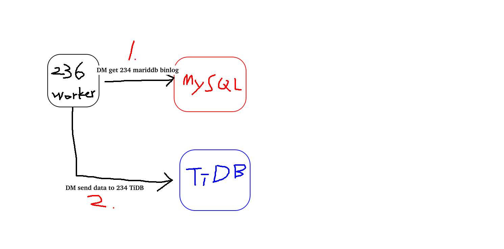

# 佈署TiDB單機模擬集群的樣子

1. 先安裝TiUP, TiUP是TiDB 4.0 版本引入的集群維運工具

```bash
curl --proto '=https' --tlsv1.2 -sSf https://tiup-mirrors.pingcap.com/install.sh | sh
```

設置環境變數

```bash
source .bash_profile
```

確認指令

```bash
tiup cluster
```

2. 設定MaxSessions, 改完要重新啟動service sshd restart, 改這個是為了防止多個程式scp文件時ssh登錄超過數量限制

```bash
vi  /etc/ssh/sshd_confi
----------------------
MaxSessions=20
```

3. 產生佈署文件

tuip cluster template > topo.yaml

```yaml
# # Global variables are applied to all deployments and used as the default value of
# # the deployments if a specific deployment value is missing.
global:
 user: "tidb" #會自動產生不用管
 ssh_port: 22
 deploy_dir: "/tidb-deploy" #放執行檔(PD, TiKV, TiDB...)的地方
 data_dir: "/tidb-data" #放資料的地方

# # Monitored variables are applied to all the machines.
monitored:
 node_exporter_port: 9100
 blackbox_exporter_port: 9115

server_configs:
 tidb:
   log.slow-threshold: 300
 tikv:
   readpool.storage.use-unified-pool: false
   readpool.coprocessor.use-unified-pool: true
 pd:
   replication.enable-placement-rules: true
   replication.location-labels: ["host"]
 tiflash:
   logger.level: "info"

pd_servers:
 - host: 192.168.xxx.xxx

tidb_servers:
 - host: 192.168.xxx.xxx

tikv_servers:
 - host: 192.168.xxx.xxx
   port: 20160
   status_port: 20180
   config:
     server.labels: { host: "test-kv-1" }

 - host: 192.168.xxx.xxx
   port: 20161
   status_port: 20181
   config:
     server.labels: { host: "test-kv-2" }

 - host: 192.168.xxx.xxx
   port: 20162
   status_port: 20182
   config:
     server.labels: { host: "test-kv-3" }

tiflash_servers:
 - host: 192.168.xxx.xxx

monitoring_servers:
 - host: 192.168.xxx.xxx

grafana_servers:
 - host: 192.168.xxx.xxx
```

4. 佈署

```bash
tiup cluster deploy tidb-test v5.4.0 ./topo.yaml --user root -p
```

5. 查看TiUP管理的集群

```bash
tiup cluster list
```

6. 查看剛剛佈署好tidb-test

```bash
tiup cluster display tidb-test
```


TiDB Lightning原理 高速導入資料到TiDB

導入模式(TiDB Lightning 會自動把 TiKV切換成這個模式 會影響寫入效率)

建立schema和表

分割表

讀取SQL dump

寫入本地臨時存取文件

寫入資料到TiKV集群

檢查和分析

普通模式

有3種模式 local-backend(最快 最耗資源 版本要4.0.0以上 不支持事務 table不可以有資料) importer-backend(中間 資源還好 版本都可以 需要多安裝tikv-importer 不支持事務 table不可以有資料) TiDB-backend(最慢 最不耗資源 版本要都可以 支持事務 table可以有資料)

很吃硬體, 建議單獨部屬Lightning

-------

TiDB Data Migration (DM) 很重要

兼容MySQL的數據遷移工具, 支持全量傳遞跟增量的同步(異步的遷移, 不能即時呈現改變), 可以操作表與操作(只要Insert 不要 delete)的過濾


DM-Master(高可用的節點, 協調Worker的任務)  <--  dmctl(操作管理DM)
    |
    |
    |
    V
DM-Worker(負責搬運資料的, 一個Worker對一個資料庫)

產生設定檔
tiup dm template > xxx.yaml

部署dm
tiup dm deplay ${name} ${version} ./xxx.yaml --user root -P

列出dm版本
tiup list dm_master

啟動dm
tiup dm start ${name}

dm的配置

表的過濾 操作的過濾 表的路由

Mysql同步到TiDB(用TiDM)

https://docs.pingcap.com/zh/tidb/stable/migrate-data-using-dm#%E7%AC%AC-4-%E6%AD%A5%E9%85%8D%E7%BD%AE%E4%BB%BB%E5%8A%A1

https://docs.pingcap.com/zh/tidb/stable/quick-start-create-task




1. 先確認MariaDB的設定 是否設定 server_id binlog要開且設定要長這樣binlog_format=ROW跟binlog_row_image=FULL DM工具只支持這2個

2. 建立MariaDB的帳號給DMworker用

3. 安裝DM群集 (看官方文件 一下上手)

4. 配置DM連MariaDB的設定檔

```ini
source-id: "mysql-234"    # 数据源 ID，在数据迁移任务配置和 dmctl 命令行中引用该 source-id 可以关联到对应的数据源

from:
  host: "192.168.199.234"
  port: 3306
  user: "syncer"
  password: "EejxfhQDBMnL5MNqFglnPkDD52fxWhQ=" # 推荐使用 dmctl 对上游数据源的用户密码加密之后的密碼

purge:
  interval: 3600
  expires: 8
  remain-space: 10
```

5. 配置同步任务 (TiDM任務配置.yaml)

6. 檢查任務配置設定 tiup dmctl --master-addr 192.168.199.236:8261 check-task task234.yaml

7. 啟動任務 tiup dmctl --master-addr 192.168.199.236:8261 start-task task234.yaml

8. 查詢任務 tiup dmctl --master-addr 192.168.199.236:8261 query-status

9. 停止任務 tiup dmctl --master-addr 192.168.199.236:8261 stop-task test234 (用任務配置的name)

10. 監控跟查log 192.168.199.236:3000 => Grafana


TiDB Binlog 收集TiDB的binlog,提供備份跟同步 5.0之後建議使用TiCDC 這個不要用

資料同步：同步TiDB集群資料到到其他資料庫
定時備份和恢復：備份TiDB集群資料, 與可以用來修復資料集群資料

TiCDC

