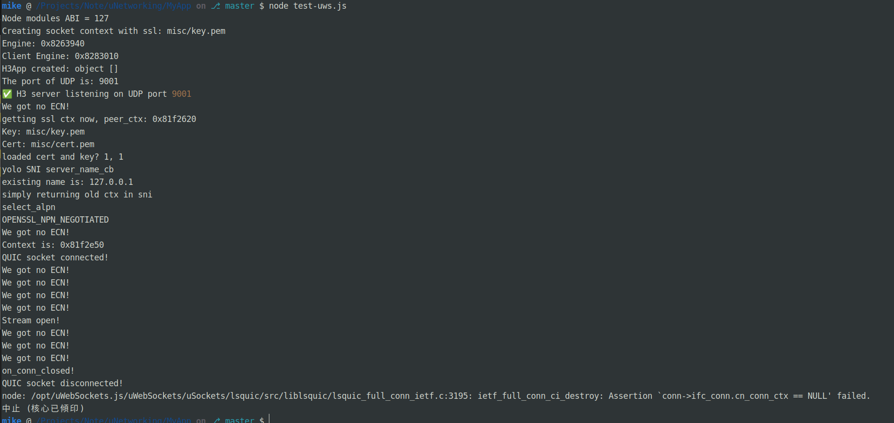

# 怎麼執行

1. npm i
2. node test-uws.js
3. curl http://localhost:9001/

# 怎麼測試

我是用一個有編譯安裝好curl http3 的 docker

sudo docker run --rm --network host ymuski/curl-http3 curl --http3 -k -v https://127.0.0.1:9001/

那個錯誤原因在這邊

